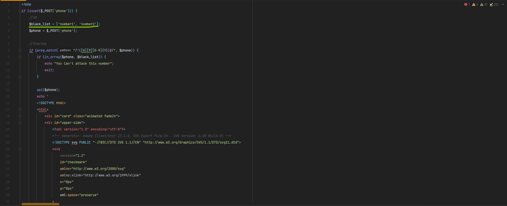

# mp-sms-bomber

> **Disclaimer:** This project is only for personal learning and communication, please do not use it for illegal purposes, please do not use it in a production environment

## api sms


| Features                           |      Enable?       |
| ---------------------------------- | :----------------: |
| divar                              | :heavy_check_mark: || bama                               | :heavy_check_mark: |
| nobatir                            | :heavy_check_mark: || snapp_express                      | :heavy_check_mark: |
| azki                               | :heavy_check_mark: || igap                               | :heavy_check_mark: |
| REST API                           | :heavy_check_mark: || digikala jet                       | :heavy_check_mark: |
| snapp drivers                      | :heavy_check_mark: || snap doctor                        | :heavy_check_mark: |
| ostadkar                           | :heavy_check_mark: || miare                              | :heavy_check_mark: |
| tapsi drivers                      | :heavy_check_mark: || tapsi passenger                    | :heavy_check_mark: |
| banimode                           | :heavy_check_mark: || taaghche                           | :heavy_check_mark: |
| mobit                              | :heavy_check_mark: || jabama                             | :heavy_check_mark: |
| ghabzino                           | :heavy_check_mark: || komodaa                            | :heavy_check_mark: |
| barghe man                         | :heavy_check_mark: || behtarino                          | :heavy_check_mark: |
| kilid                              | :heavy_check_mark: || vendar                             | :heavy_check_mark: |
| pinorest                           | :heavy_check_mark: || technolife                         | :heavy_check_mark: |
| bit24                              | :heavy_check_mark: || tetherland                         | :heavy_check_mark: |
| alibaba                            | :heavy_check_mark: || drdr                               | :heavy_check_mark: |
| tikban                             | :heavy_check_mark: || drnext                             | :heavy_check_mark: |
| alopeyk                            | :heavy_check_mark: || alopeyk 2                          | :heavy_check_mark: |
| digistyle                          | :heavy_check_mark: |

## Install & Upgrade to Latest Version
```sh
git clone https://github.com/mpineal/mp-sms-bomber/
```
### Black list

**Step 1:** open the src.php

**Step 2:** edit the black list number input your number

----------------------------------------------------------


## Features

- public proxy for dont  tracking
- call bomber
- Send number button
- more api
## Preview


### Usage

**Step 1:** downlaod the source

```shell
git clone https://github.com/mpineal/mp-sms-bomber
```

**Step 2:** install source on your website 

-----------------------------------------------


- 👯 I’m looking to collaborate on [mp-sms-bomber](https://github.com/mpineal/mp-sms-bomber)

- 💬 Ask me about **php,bash**

- 📫 How to reach me **support@mpineal.com**

<h3 align="left">Connect with me:</h3>
<p align="left">
<a href="https://instagram.com/sorenadelavar" target="blank"></a>
</p>

<h3 align="left">Languages and Tools:</h3>
<p align="left"> <a href="https://www.gnu.org/software/bash/" target="_blank" rel="noreferrer">  </a> <a href="https://www.linux.org/" target="_blank" rel="noreferrer">  </a> <a href="https://www.php.net" target="_blank" rel="noreferrer">  </a> </p>
